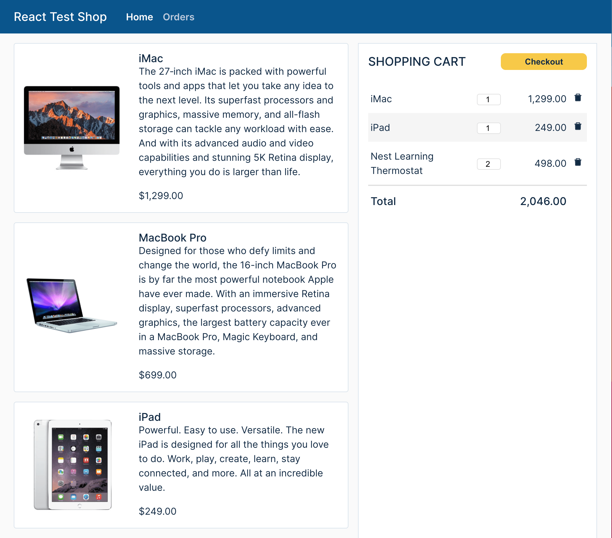

# React Testing Techniques

This project implements an online shopping application to show techniques used
to test React applications. We use the following tools for testing:

**Unit Testing**

- [Jest](https://jestjs.io/) - a testing framework designed to ensure
  correctness of any JavaScript or TypeScript codebase

- [React Testing Library](https://testing-library.com/) - a testing framework
  for React components that encourages better testing practices

- [Mock Service Worker](https://mswjs.io/) - a framework to mock APIs by
  intercepting requests at the network level. It allows us to reuse the same
  mock definition for testing, development, and debugging.

**Integration Testing**

- [Cypress](https://www.cypress.io/) - a testing framework for fully built Web
  applications running in a browser

**Manual Testing**

- [Storybook](https://storybook.js.org/) - a tool that helps build components in
  isolation and record their states as stories. Stories make it easy to explore
  a component in all its permutations no matter how complex. They also serve as
  excellent visual test cases. Storybook testing can also be automated. For
  details, look at the
  [Storybook documentation](https://storybook.js.org/docs/react/workflows/testing-with-storybook).

This project was bootstrapped with
[React Accelerate](https://github.com/PublicisSapient/cra-template-accelerate).

## Screenshots

**Home page with item catalog and shopping cart**



## Getting Started

> Note: If you prefer to use npm, please feel free to replace the yarn commands
> in this section with equivalent npm commands.

Make sure your development machine is set up for building React apps. See the
recommended setup procedure
[here](https://github.com/nareshbhatia/react-learning-resources#developer-machine-setup).

Execute the following commands to install dependencies:

```sh
yarn install
```

Execute the following commands to run the app:

```sh
yarn start
```

Now point your browser to http://localhost:3000/.

## Running Unit Tests

Execute one of the following command to run unit tests.

```sh
yarn test # interactive mode

# OR

yarn test:coverage # non-interactive mode with coverage information
```

## Running End-to-End Tests

```sh
yarn start # starts a local server hosting your react app

# in a difference shell, run cypress
yarn cypress:open
```

## Running Storybook

```sh
yarn storybook
```
