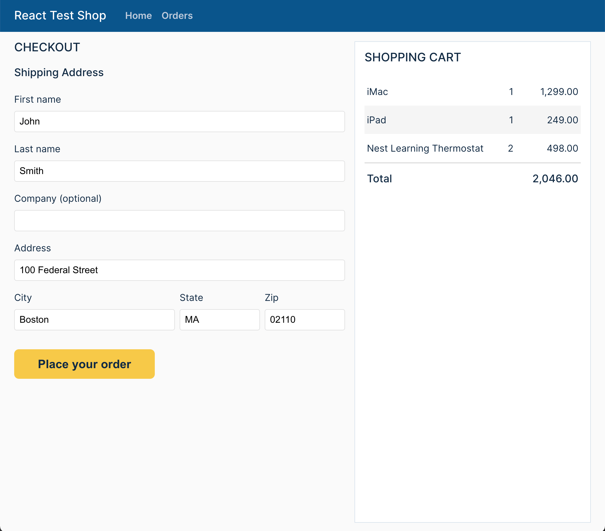
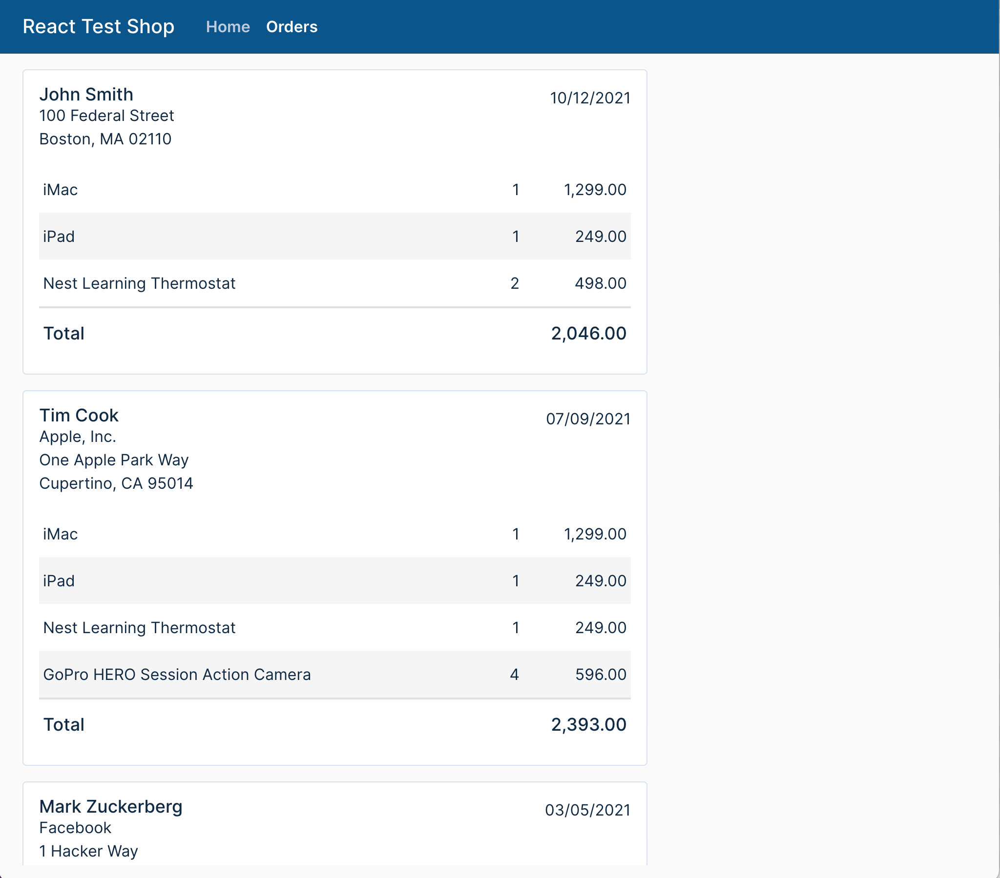

# React Testing Techniques

This project demonstrates best practices in testing React applications by
implementing a realistic online shopping application.

We use the following tools for testing:

**Unit & Integration Testing**

- [Jest](https://jestjs.io/) - a testing framework designed to ensure
  correctness of any JavaScript or TypeScript codebase

- [React Testing Library](https://testing-library.com/) - a testing framework
  for React components that encourages better testing practices

- [Mock Service Worker](https://mswjs.io/) - a framework to mock APIs by
  intercepting requests at the network level. It allows us to reuse the same
  mock definition for testing, development, and debugging.

**End-to-End Testing**

- [Cypress](https://www.cypress.io/) - a testing framework for fully built Web
  applications running in a browser

**Manual Testing**

- [Storybook](https://storybook.js.org/) - a tool that helps build components in
  isolation and record their states as stories. Stories make it easy to explore
  a component in all its permutations no matter how complex. They also serve as
  excellent visual test cases. Storybook testing can also be automated. For
  details, look at the
  [Storybook documentation](https://storybook.js.org/docs/react/workflows/testing-with-storybook).

_This project was bootstrapped with
[React Accelerate](https://github.com/PublicisSapient/cra-template-accelerate)._

## Why do we write tests?

For me, writing tests is about building confidence in what I am delivering.
Tests provide a mechanism to verify the intent of my code by exercising it in
various ways. Moreover, they give me the confidence that I have not broken
anything when I refactor or extend the code to meet new requirements. The last
thing I want is to get a call at 3:00 AM to fix a bug that has crashed my app!

## Guiding principles for writing tests

The principles listed in this section are based on an article by Kent C. Dodds
titled
[Write tests. Not too many. Mostly integration.](https://kentcdodds.com/blog/write-tests)
Kent is a testing guru with very good guidance on how to test effectively. I
have listed several of his useful articles in the references below.

So without further ado, let's jump into the guiding principles.

### Don't test implementation details

If your test does something that your user doesn't, chances are that you are
testing implementation details. For example, you may be exposing a private
function just to test your component. This is a code smell – don't do it. A
refactor can easily break your test. So stay away from testing tools that allow
you to test implementation details (e.g. Enzyme), and instead use tools that
make it harder (e.g. [React Testing Library](https://testing-library.com/)).

### Test your components as a user would

The classic testing wisdom was to write a lot of unit tests to test individual
"units" of code. We used to isolate our components from their environment using
mocks. This approach still makes sense for pure functions, but for UI
components, which depend on communications with surrounding components, mocking
reduces our confidence in their integrations. So the latest thinking is to test
several units together to recreate real interaction scenarios, hence the name
_integration testing_.

This brings us to the guiding principle which is the foundation of the React
Testing Library:

> The more your tests resemble the way your software is used, the more
> confidence they can give you.

For example, drop a couple of components under a `<Context.Provider>` to test
real user interactions. Or use [Mock Service Worker](https://mswjs.io/) to mock
APIs at the network level rather than excessively mocking at the component or
service layer.

### Don't be obsessed with code coverage

There is a tradeoff between time spent writing tests and code coverage. Some
organizations put undue focus on code coverage. Unfortunately this sets the
wrong goal for developers - after a certain point, the returns are not worth the
effort. You start seeing developers gaming the system by writing meaningless
tests. Instead, focus on _use case coverage_. Think of all the use cases
(including corner cases) that you want to test to feel confident about your
code. This approach will automatically yield high code coverage.

### Push business logic into pure functions rather than UI components

For example, a Shopping Cart UI component should not compute the cart total.
This should be pushed to a
[pure function](https://en.wikipedia.org/wiki/Pure_function) because it is
easier to test. Even better, push it off to the back-end where more
sophisticated calculations can be performed without complicating the UI. See
[here](./src/models/Cart.ts) for examples for pure functions and the
[related tests](./src/models/Cart.test.ts).

## Techniques

- [Snapshot testing vs. traditional unit testing](./docs/snapshot-testing-vs-traditional-unit-testing.md)
- [Difference between queryBy, getBy and findBy queries](./docs/difference-between-query-types.md)
- [Checking for existence of an element](./docs/checking-for-existence-of-an-element.md)
- [Waiting for removal of an element](./docs/waiting-for-removal-of-an-element.md)
- [Waiting for something to happen](./docs/waiting-for-something-to-happen.md)
- [fireEvent() vs userEvent](./docs/fireEvent-vs-userEvent.md)
- [Mocking an event handler](./docs/mocking-an-event-handler.md)
- [Avoid mocking by using Mock Service Worker](./docs/avoid-mocking-by-using-mock-service-worker.md)
- [Overriding MSW handlers](./docs/overriding-msw-handlers.md)
- Testing for page navigation
- Suppressing console errors

## Getting Started

> Note: If you prefer to use npm, please feel free to replace the yarn commands
> in this section with equivalent npm commands.

Make sure your development machine is set up for building React apps. See the
recommended setup procedure
[here](https://github.com/nareshbhatia/react-learning-resources#developer-machine-setup).

Execute the following commands to install dependencies:

```sh
yarn install
```

Execute the following commands to run the app:

```sh
yarn start
```

Now point your browser to http://localhost:3000/.

## Running Unit Tests

Execute one of the following command to run unit tests.

```sh
yarn test # interactive mode

# OR

yarn test:coverage # non-interactive mode with coverage information
```

## Running End-to-End Tests

```sh
yarn start # starts a local server hosting your react app

# in a difference shell, run cypress
yarn cypress:open
```

## Running Storybook

```sh
yarn storybook
```

## Screenshots

### Home Page


### Checkout Page



### Orders Page



## References

### Testing Best Practices

- [How to know what to test](https://kentcdodds.com/blog/how-to-know-what-to-test)
- [Write tests. Not too many. Mostly integration.](https://kentcdodds.com/blog/write-tests)
- [Write fewer, longer tests](https://kentcdodds.com/blog/write-fewer-longer-tests)
- [Making your UI tests resilient to change](https://kentcdodds.com/blog/making-your-ui-tests-resilient-to-change)
- [Testing Implementation Details](https://kentcdodds.com/blog/testing-implementation-details)

### Jest

- [Documentation](https://jestjs.io/docs/getting-started)

### React Testing Library

- [Introduction](https://testing-library.com/docs/)
- [Guiding Principles](https://testing-library.com/docs/guiding-principles)
- [Example](https://testing-library.com/docs/react-testing-library/example-intro)
- [Cheatsheet](https://testing-library.com/docs/react-testing-library/cheatsheet)
- [Common mistakes with React Testing Library](https://kentcdodds.com/blog/common-mistakes-with-react-testing-library)

### Storybook

- [Introduction to Storybook](https://storybook.js.org/docs/react/get-started/introduction)

### Mock Service Worker

- [Documentation](https://mswjs.io/docs/)

### Cypress

- [Documentation](https://docs.cypress.io/guides/overview/why-cypress)
